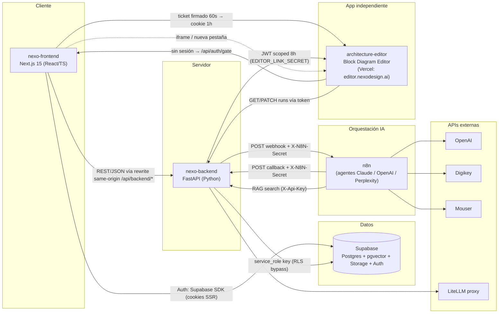
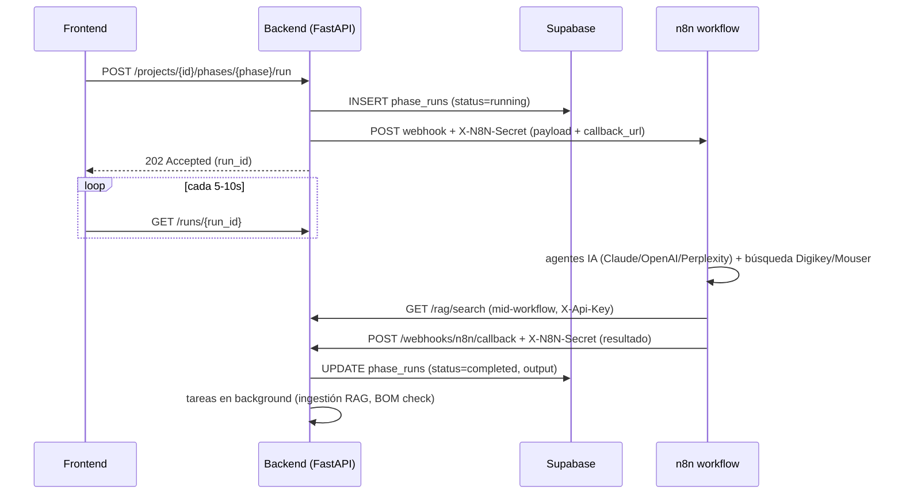
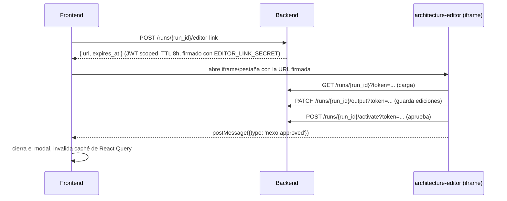
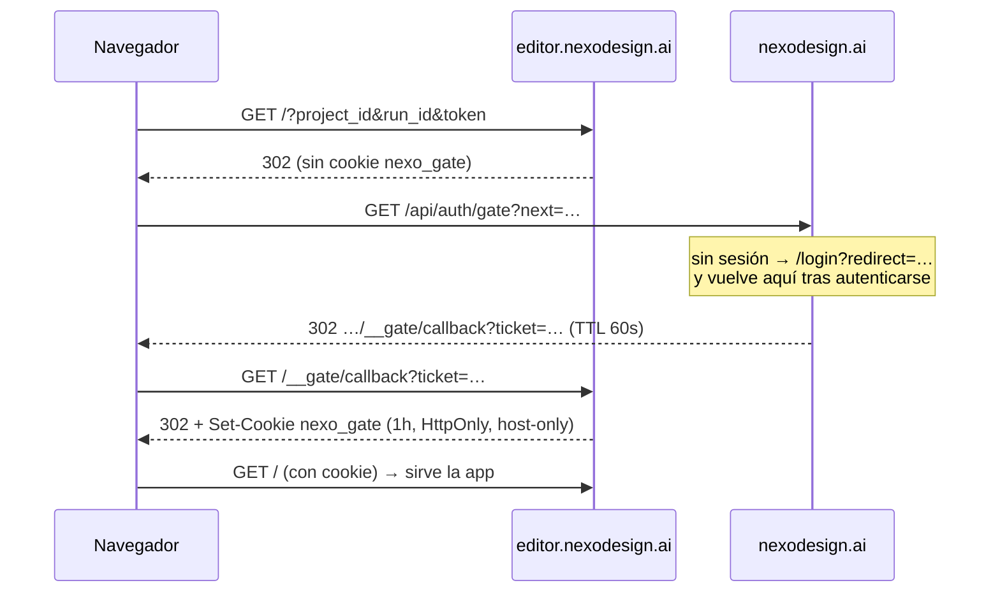
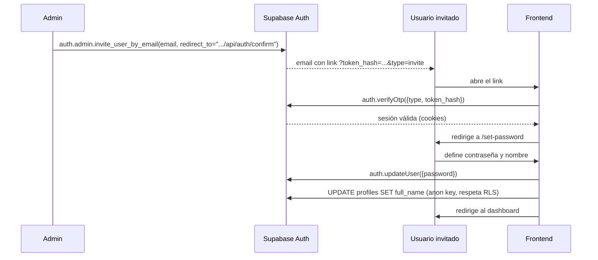

# Nexo Design

## Documentacion general del proyecto


## 0. Resumen ejecutivo

Nexo Design es una plataforma de **diseño electrónico asistido por IA**: un ingeniero crea un Proyecto y lo hace avanzar por un pipeline de fases (investigación de componentes, selección de ICs (integrated circuit), arquitectura del sistema, componentes pasivos, selección de componentes, netlist). Cada fase se ejecuta como un **workflow de n8n** con agentes LLM (Claude, OpenAI, etc), y una de las fases (`architecture_agent`) produce un diagrama de bloques que el ingeniero revisa/edita en una herramienta visual dedicada (el **Block Diagram Editor**).

El sistema **no es un monorepo**: son 4 repositorios hermanos en el mismo workspace local, cada uno con una responsabilidad distinta.



---

## 1. Repositorios y responsabilidades

| Repositorio | Rol | Stack | Hosting |
|---|---|---|---|
| `nexo-frontend` | UI web, autenticación de usuario, cliente delgado hacia el backend | Next.js 15 (App Router), React 18, TypeScript | Vercel |
| `nexo-backend` | API central, lógica de negocio, acceso a Supabase, orquestación de n8n, integración con APIs de componentes | FastAPI (Python), Uvicorn | Render.com |
| `architecture-editor` | Editor visual de diagramas de bloques ("Block Diagram Editor" / "System Diagram App"), app independiente embebida en el frontend | JS estático (SPA) | Vercel — `editor.nexodesign.ai`, tras la puerta de autenticación (sección 6.1) |
| `workflows n8n` | Motor de orquestacion de los agentes IA para las fases | JSON exportado de n8n | render.com (self-hosted n8n) |

La instancia de n8n en sí (`https://nexo-n8n.onrender.com`) no tiene repo propio en este workspace: los workflows se editan directamente en su UI web; el JSON exportado es solo una copia de referencia.

---

## 2. Frontend (`nexo-frontend`)

- **Framework**: Next.js 15.0.5, App Router (`src/app/`), React 18, TypeScript 5.
- **i18n**: `next-intl` v3.14 con segmento dinámico `[locale]` (`es`/`en`, default `es`), rutas agrupadas en `(auth)`, `(dashboard)`, `(public)`.
- **Estado de servidor**: TanStack React Query v5 (`components/layout/Providers.tsx`), sin store global (Redux/Zustand); estado local con `useState` y hooks propios (`src/hooks/useRunStatus.ts`, `src/hooks/useCustomOutputs.ts`).
- **UI**: Tailwind CSS + Radix UI, envueltos en componentes propios estilo shadcn (`components/ui/`). Formularios con `react-hook-form` + `zod`.
- **Auth/BaaS**: Supabase vía `@supabase/supabase-js` + `@supabase/ssr` (cliente browser en `src/lib/supabase/client.ts`, cliente servidor en `src/lib/supabase/server.ts`).

### Estructura relevante

```
src/app/[locale]/(auth)/        login, set-password
src/app/[locale]/(dashboard)/   dashboard, projects, knowledge-base
src/app/[locale]/(public)/      landing, productos
src/app/api/auth/confirm/       confirmación de invitación (Supabase OTP)
src/app/api/drive-filename/     helper server-side (Google Drive)
src/lib/api.ts                  único cliente HTTP hacia el backend
src/lib/constants.ts            IDs de workflows n8n, URL del block diagram editor
src/lib/supabase/               clientes Supabase (browser/server)
src/middleware.ts               auth + i18n middleware
components/pipeline/            UI del pipeline de fases (PhaseCard, PipelineView, ArchitectureDiagramModal…)
```

### Comunicación con el backend

El frontend **nunca llama directamente a la URL pública del backend** desde el navegador. Usa un rewrite same-origin de Next.js:

```ts
// next.config.ts
async rewrites() {
  return [{ source: '/api/backend/:path*', destination: `${process.env.NEXT_PUBLIC_API_URL}/:path*` }]
}
```

`src/lib/api.ts` centraliza todas las llamadas (`projectsApi`, `runsApi`, `documentsApi`, `ragApi`, `normativesApi`, etc.), añadiendo en cada request:

```
Authorization: Bearer <supabase access_token>
```

obtenido en el momento con `createClient().auth.getSession()`.

Esto evita problemas de CORS (la petición del navegador es same-origin) y oculta el origen real del backend en las herramientas de red del navegador.

---

## 3. Backend (`nexo-backend`)

- **Documentacion**: Endpoints del backend: https://nexo-backend-p5p4.onrender.com/docs
- **Framework**: FastAPI, ejecutado con `uvicorn main:app` (`run.sh`).
- **Routers principales** (`nexo-backend/routers/`): `projects`, `runs`, `pipeline`, `webhooks`, `documents`, `rag`, `requirements_runs`, `normatives`, `components`, `profile`, `custom_outputs`.
- **CORS**: restringido por `settings.ALLOWED_ORIGINS` (pensado para limitarse al dominio del frontend en producción).
- **Patrón dominante: trigger → webhook → callback**, usado por el pipeline principal, por "requirements" y por "normativas":
  1. El frontend hace `POST /projects/{id}/phases/{phase}/run`.
  2. El backend arma el payload (requisitos del proyecto + outputs de fases previas + contexto RAG), crea una fila en `phase_runs` con `status='running'`, y dispara el webhook de n8n correspondiente. Devuelve `202 Accepted` de inmediato (fire-and-forget).
  3. n8n ejecuta el workflow (agentes LLM, búsquedas en Digikey/Mouser, etc.).
  4. n8n llama de vuelta a `POST /webhooks/n8n/callback` con el resultado; el backend actualiza el run y dispara tareas en segundo plano (ingestión RAG, chequeo de BOM).
  5. El frontend, mientras tanto, hace **polling** cada 5–10s (no hay WebSockets ni SSE en el proyecto).

### Servicios clave

| Archivo | Responsabilidad |
|---|---|
| `services/n8n_service.py` | Construye el payload de cada fase y dispara el webhook de n8n (`X-N8N-Secret`) |
| `routers/webhooks.py` | Recibe el callback de n8n al terminar un workflow |
| `core/security.py` | Las tres formas de autenticación de la API (ver sección 8) |
| `services/embedding_service.py` / `services/ingestion_service.py` | Generación de embeddings (OpenAI `text-embedding-3-small`) e ingestión de documentos para RAG |
| `services/bom_service.py` | Verificación de disponibilidad/stock de componentes contra Digikey/Mouser |
| `services/normative_service.py` | Sugerencia de normativas aplicables vía un agente n8n ("GPT mini agent") |

### Componentes / BOM

`routers/components.py` expone búsqueda de componentes (clasificación de pasivos → búsqueda en Digikey → verificación cruzada en Mouser) — endpoint reutilizado tanto por el frontend como por nodos HTTP Request dentro de los propios workflows de n8n.

---

## 4. Base de datos (Supabase)

- **Motor**: Postgres gestionado por Supabase, con extensión **pgvector** para embeddings (columna `vector(1536)`, función RPC `search_documents`).
- **Storage**: bucket `documents` para archivos subidos (datasheets, normativas, etc.), rutas tipo `projects/{project_id}/{uuid}{ext}`.
- **Auth**: gestionado por Supabase Auth (usuarios, invitaciones, tokens OTP).

### Acceso dual

| Quién accede | Cliente | Key | Efecto |
|---|---|---|---|
| Frontend (browser/SSR) | `@supabase/ssr` | `NEXT_PUBLIC_SUPABASE_ANON_KEY` | Respeta Row Level Security (RLS) |
| Backend (FastAPI) | `supabase-py` | `SUPABASE_SERVICE_KEY` (service_role) | **Bypassea RLS** — ver sección 11 |

### Tablas de la base de datos

`profiles`, `projects`, `project_requirements`, `pipeline_phases`, `phase_runs`, `project_active_runs`, `custom_phase_output_items`, `documents`, `document_chunks`, `project_normatives`, `normative_runs`.

---

## 5. n8n — integración y workflows

n8n es el motor de orquestación de los agentes de IA. El frontend **nunca llama a n8n directamente**; solo construye enlaces de solo lectura hacia la UI de n8n para debug.

### Secuencia de ejecución de una fase



---

## 6. Block Diagram Editor (`architecture-editor`)

Es una **aplicación independiente** (no vive dentro de `nexo-frontend`), sitio estático servido en su propio proyecto de Vercel bajo `editor.nexodesign.ai`. El frontend accede de dos formas:

1. **Modal con iframe**
2. **Abirendolo en una nueva pestaña** enlazado a la ejecucion con un token JWT de 8h de duracion

### Hand-off seguro



El editor **no tiene sesión de Supabase ni credenciales propias** — el token scoped (project+run, 8h) es lo único que necesita para hablar con el backend, sin exponer nunca el JWT real del usuario.

⚠️ El listener de `postMessage` en `ArchitectureDiagramModal.tsx` **no valida `event.origin`** — ver sección 11.

Si no hay aprobación en la misma pestaña (caso "nueva pestaña"), el frontend detecta el cambio por polling/`refetchOnWindowFocus`, no por un mecanismo push.

---

## 6.1. Puerta de autenticación de subdominios

El token scoped de la sección anterior protege los **datos** de un run, pero no la **página**: el sitio estático era descargable por cualquiera que conociera la URL. Delante de cada subdominio hay ahora una puerta que exige sesión de Nexo antes de servir nada.

No es código del editor: es un patrón reutilizable para todas las herramientas que vivan en subdominios (`datasheet_extractor` será la siguiente). La fuente canónica y la guía de instalación están en `nexo-frontend/docs/gate-middleware/`.

### Las dos mitades

| Mitad | Dónde | Qué hace |
|---|---|---|
| Emisor | `src/app/api/auth/gate/route.ts` (nexo-frontend) | Valida la sesión con `supabase.auth.getUser()` y acuña un ticket HS256 de 60 s, con `aud` = origen del subdominio |
| Verificador | `middleware.ts` en cada subdominio (Routing Middleware de Vercel) | Cambia el ticket por una cookie de sesión de 1 h y sirve; sin cookie, manda al emisor |



### Decisiones que conviene no deshacer

- **Ticket en vez de compartir la cookie de Supabase en `.nexodesign.ai`.** Una cookie compartida dejaría que cualquier subdominio leyera la sesión completa del usuario: un XSS en la herramienta más pequeña se llevaría la cuenta entera. Así, cada subdominio tiene una sesión propia de una hora y nunca ve el JWT de Supabase.
- **La puerta no hereda el problema #1 de la sección 11.** El emisor valida con `supabase.auth.getUser()`, que sí verifica contra Supabase; no depende del decodificado sin firma del backend.
- **`SameSite=Lax` basta** porque `editor.nexodesign.ai` y `nexodesign.ai` comparten dominio registrable: son same-site, así que la cookie viaja dentro del iframe del modal. Con un dominio distinto haría falta `SameSite=None`.
- **El `matcher` del middleware es una decisión de coste.** Vercel factura por invocación y aplica el matcher antes de invocar, así que lo excluido es gratis. Se excluye solo lo ya público (`lib/`, el logo); todo lo propio —`app.js`, `styles.css`, `credential/`— pasa por la puerta.
- **Un ticket inválido en el callback devuelve 401, nunca una redirección** al emisor: eso sería un bucle.

### Qué NO comprueba

Solo autenticación, que es lo que el resto de la aplicación exige hoy (ver problema #3). El predicado vive en `nexo-backend/core/authz.py` (`assert_can_access_project`), que llaman tanto el endpoint `editor-link` como el emisor, para que el día que existan permisos por proyecto ambos se cierren a la vez y no se pueda esquivar uno pidiendo el otro.

---

## 7. Autenticación y sesiones — extremo a extremo

**Proveedor**: Supabase Auth (email+password + invitación por email). Sin login social/OAuth.

### 7.1 Alta de usuario invitado



Commit reciente relevante: `e71dcf7` cambió el flujo de `exchangeCodeForSession` (PKCE, requiere `code_verifier` en el mismo navegador) a `token_hash` + `verifyOtp`, el mecanismo correcto de Supabase para links de invitación/magic-link/recovery abiertos potencialmente en otro dispositivo/navegador.

Actualmente la invitación se dispara con un script manual (`nexo-backend/tests/invite_test_user.py`) usando la service-role key — no hay UI de administración para invitar usuarios todavía.

### 7.2 Login normal

`supabase.auth.signInWithPassword({ email, password })` desde `src/app/[locale]/(auth)/login/page.tsx`.

### 7.3 Middleware (`src/middleware.ts`)

Se ejecuta en cada request (excepto `_next/static`, `_next/image`, `favicon.ico`, `api/*`, `media/*` y extensiones multimedia):
- Refresca la sesión con `supabase.auth.getUser()`.
- Rutas públicas: `/login`, `/home`, `/productos` — todo lo demás requiere usuario autenticado.
- Usuario no autenticado en ruta protegida → redirige a `/home` (si era la raíz) o `/login`.
- Usuario autenticado visitando `/login` → redirige al dashboard.
- Fusiona las cabeceras `Set-Cookie` de Supabase con la respuesta del middleware de `next-intl`.

### 7.4 Las tres formas de autenticación del backend (`nexo-backend/core/security.py`)

| Mecanismo | Uso | Detalle |
|---|---|---|
| JWT de Supabase (`Authorization: Bearer`) | Llamadas normales del frontend autenticado | ⚠️ **Se decodifica sin verificar la firma** (reemplazar por verificación RS256 completa al escalar a SaaS") |
| `X-Api-Key` estático (`N8N_SERVICE_API_KEY`) | n8n → backend (ej. RAG search a mitad de workflow) | Resuelve a un `N8N_SERVICE_USER_ID` fijo |
| JWT scoped de editor (`EDITOR_LINK_SECRET`, HS256, TTL 8h) | architecture-editor → backend | Limitado a un `project_id`+`run_id` concreto, secreto distinto al de Supabase |

Los webhooks de n8n (`/webhooks/n8n/callback`, `/normatives/runs/{id}/complete`) **no usan ninguno de estos tres mecanismos** — se protegen solo con el secreto compartido `X-N8N-Secret`, porque n8n no puede adjuntar fácilmente un Bearer token por usuario.

---

## 8. Variables de entorno / secretos

### `nexo-frontend`
```
NEXT_PUBLIC_SUPABASE_URL
NEXT_PUBLIC_SUPABASE_ANON_KEY
NEXT_PUBLIC_API_URL          # URL del backend FastAPI (destino del rewrite)
NEXT_PUBLIC_APP_URL
GATE_TICKET_SECRET           # firma HS256 de los tickets de subdominio (sección 6.1)
GATE_ALLOWED_ORIGINS         # subdominios para los que se acuñan tickets
```

### Cada subdominio con puerta (`architecture-editor`, …)
```
GATE_TICKET_SECRET           # el mismo que en nexo-frontend
GATE_ISSUER_URL              # https://nexodesign.ai
GATE_SELF_ORIGIN             # el origen propio, p. ej. https://editor.nexodesign.ai
```

### `nexo-backend`
```
SUPABASE_URL
SUPABASE_SERVICE_KEY               # service_role — bypassea RLS
N8N_BASE_URL
N8N_WEBHOOK_SECRET                 # secreto compartido n8n ↔ backend
N8N_REQUIREMENTS_WEBHOOK_URL
N8N_NORMATIVES_WEBHOOK_URL
N8N_NORMATIVES_SUGGEST_WEBHOOK_URL
BACKEND_URL                        # auto-referencia, para construir callback_url hacia n8n
OPENAI_API_KEY                     # embeddings (text-embedding-3-small)
DIGIKEY_CLIENT_ID / DIGIKEY_CLIENT_SECRET
MOUSER_API_KEY
N8N_SERVICE_API_KEY / N8N_SERVICE_USER_ID
ALLOWED_ORIGINS                    # CORS
EDITOR_LINK_SECRET                 # firma HS256 del token del Block Diagram Editor
ARCHITECTURE_EDITOR_URL
```

Estas variables revelan los servicios externos integrados: **Supabase, n8n, OpenAI, Digikey, Mouser**.

---

## 9. Despliegue e infraestructura

El despliegue se hace directamente desde cada herramienta (vercel, render, n8n). No hay ningun workflow de CI/CD (`.github/workflows/`) en ninguno de los 4 repositorios.

No hay tests automatizados de integración ni pipeline de CI en ningun caso.

Los repositorios viven en la organización **`NexoDesigns`**. `architecture-editor` es un proyecto de Vercel aparte del frontend (framework preset "Other", sin build command): deploys independientes y preview por PR, que es como se desarrolla ese repo. Su `vercel.json` fija las cabeceras estáticas y su `.vercelignore` deja fuera del deploy los scripts de test y `fixtures/`, que no forman parte de la app y solo llegaban a producción porque el sitio era el repo entero.

---

## 10. Protocolos y formatos, resumen rápido

| Conexión | Protocolo | Formato | Autenticación |
|---|---|---|---|
| Frontend ↔ Backend | HTTPS (rewrite same-origin) | JSON/REST | Bearer JWT Supabase |
| Frontend ↔ Supabase | HTTPS (SDK) | JSON/REST + cookies | Anon key + JWT (RLS activo) |
| Backend ↔ Supabase | HTTPS (SDK) | JSON/REST | service_role key (RLS bypass) |
| Backend → n8n | HTTPS (webhook POST) | JSON | Header `X-N8N-Secret` |
| n8n → Backend (callback) | HTTPS (POST) | JSON | Header `X-N8N-Secret` |
| n8n → Backend (RAG mid-workflow) | HTTPS (GET/POST) | JSON | Header `X-Api-Key` |
| Backend ↔ architecture-editor | HTTPS (REST) | JSON | JWT scoped (query param `token`) |
| Frontend ↔ architecture-editor | iframe / `window.open` + `postMessage` | HTML/JS + evento `postMessage` | Token embebido en la URL (sin validar `event.origin` en el listener) |
| Navegador ↔ subdominio con puerta | HTTPS (302 + cookie) | — | Ticket HS256 de 60 s → cookie `nexo_gate` de 1 h, HttpOnly y host-only (sección 6.1) |
| Backend → OpenAI/Digikey/Mouser/LiteLLM | HTTPS (REST) | JSON | API keys estáticas |

---

## 11. Problemas de seguridad conocidos

| # | Problema | Ubicación | Riesgo |
|---|---|---|---|
| 1 | El JWT de Supabase se decodifica **sin verificar la firma** en el backend | `nexo-backend/core/security.py` (`get_current_user_id`) | Un token manipulado con `sub`/`exp` válidos pero firma inválida podría ser aceptado. Se usa por ahora solo para el MVP, igual conviene cambiarlo ya antes de seguir creciendo el proyecto. |
| 2 | El backend accede a Supabase con la `service_role` key en (casi) todas las operaciones | `nexo-backend/core/supabase.py` | RLS queda sin efecto real; toda la autorización depende de los checks (limitados) en los routers de FastAPI. |
| 3 | El rol `engineer`/`admin` (`Profile.role`) existe en el modelo de datos pero no se usa en ningún control de acceso | `src/types/index.ts`, routers de `nexo-backend` | No hay separación de permisos real entre roles — cualquier usuario autenticado puede, en principio, hacer cualquier operación que un router permita. |
| 4 | Los webhooks n8n↔backend se autentican solo con un secreto estático compartido en cabecera, sin firma HMAC del payload ni verificación de origen/IP | `nexo-backend/routers/webhooks.py`, `routers/requirements_runs.py`, `routers/normatives.py` | Si el secreto se filtra, cualquiera puede simular un callback de n8n (marcar runs como completados con output arbitrario). |
| 5 | El listener de `postMessage` en el modal del Block Diagram Editor no valida `event.origin` | `components/pipeline/ArchitectureDiagramModal.tsx` | Cualquier página capaz de enviar un mensaje a esa ventana (ej. otro iframe malicioso si se compromete la página) podría disparar `onApproved()` suplantando al editor legítimo. **Ahora es un arreglo de una línea**: desde el traslado a Vercel el editor tiene un origen propio y fijo, así que basta comparar `event.origin` con `https://editor.nexodesign.ai`. Antes no se podía, porque el origen era el `github.io` compartido con cualquier otro usuario de Pages. |
| 6 | No hay CSP en el frontend, ni atributo `sandbox` en los iframes (`ArchitectureDiagramModal`, `DriveEmbed`), ni pipeline de CI/CD | `next.config.ts`, `components/pipeline/ArchitectureDiagramModal.tsx`, `components/projects/DriveEmbed.tsx` | Superficie de ataque más amplia de lo necesario para contenido embebido de terceros; sin tests automáticos que detecten regresiones antes de desplegar. El editor **sí** tiene ya `frame-ancestors` (su `vercel.json`), así que solo puede ser embebido desde `nexodesign.ai`; falta el resto. |
| 7 | Las credenciales de DigiKey y Mouser están commiteadas en `architecture-editor/credential/*.json` y `app.js` las descarga desde el navegador | `architecture-editor/app.js:5027`, `credential/` | Estuvieron públicas mientras el repo sirvió GitHub Pages: **hay que rotarlas**, y siguen en el historial de git. La puerta de la sección 6.1 las tapa frente a anónimos, pero no frente a cualquier usuario autenticado de Nexo ni frente al historial. El arreglo de fondo es que el editor pida la búsqueda a `nexo-backend/routers/components.py`, que ya hace DigiKey→Mouser, con su token scoped. |
