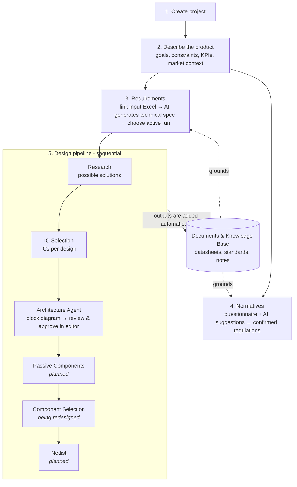

# Nexo Design: how the app is meant to be used

**Brief for the frontend redesign of the logged-in app**

---

## 0. About this document

This brief explains **what the Nexo Design app does, who uses it, and how its work flows**, so a design team can rebuild the frontend from first principles.

It does **not** say how anything should look. It does not prescribe screens, layouts, components, buttons, colours or visual patterns. When it names a current screen or control, that is only to point at an existing behaviour. It is not a request to keep it. The design team is free to reorganise, merge, split or rethink anything here, as long as the **capabilities, rules and dependencies** described below still hold.

**In scope:** everything a user sees **after logging in** on `nexodesign.ai`: dashboard, projects, the project workspace and all its sections, and the knowledge base.

**Out of scope:**
- The public marketing pages (`/home`, `/productos`).
- Login, invitation acceptance and set-password pages.
- The tools that live on their own subdomains, mainly the **System Diagram App** (`editor.nexodesign.ai`). This app *hands users off* to it and gets them back, and that hand-off is in scope (see §7.4.4). The editor's own interface is not.

Sections 1–6 describe the product from the user's side. Sections 7–9 cover each area in detail. Sections 10–12 cover engineering constraints, work in progress and open questions.

---

## 1. The product in one paragraph

Nexo Design is an **AI-assisted electronics design platform**. An engineer creates a **project** for an electronic product (for example a power supply or a connected device), describes what it must do, and then moves it through a sequence of **AI stages**. The stages turn the requirements into technical specifications, research possible solutions, pick integrated circuits (ICs), propose a system architecture as a block diagram, and later pick passive components and produce a netlist. Alongside this, the platform helps decide which **regulations** (EU directives and standards) apply to the product. Throughout, the AI agents draw on a shared library of **documents** (datasheets, standards, design notes) that users upload.

The platform does **not** design on its own. It is a **copilot**: at every stage the AI proposes options, and the engineer reviews them, picks some, edits them, re-runs them and decides what moves forward.

---

## 2. Who uses it

### 2.1 Users today and tomorrow

| Group | Who | Situation |
|---|---|---|
| **Internal engineers** (current) | Nexo Design's own electronics engineers | Use the platform every day on client projects. They know the domain very well and are used to the current tool, rough edges included. |
| **Client engineering teams** (future) | External companies subscribing to the "Platform" package | Will design their own products with the platform. They are electronics engineers too, but they **do not know Nexo's internal workflow** and will not have someone next to them to explain it. |
| **Power users / platform maintainers** | A few Nexo engineers who also build and tune the AI workflows | Need to look inside runs (raw inputs and outputs, links to the automation engine, token usage) to debug and improve the agents. See §9. |

The redesign has to serve both main groups. The internal engineer wants speed and density. The client engineer needs the workflow to explain itself: what to do next, why a step is blocked, and what each AI output means.

### 2.2 What users have in common

- They are **domain experts**. They understand ICs, part numbers, ripple, EMC, CE marking and so on. The platform should never water down technical content, but it should **organise** it.
- They usually work **on a desktop, on a large screen**, often for long stretches, and often several projects in parallel.
- They work in **English or Spanish**. The whole interface must work in both (see §10.6).
- Several people may work on the **same project**. Every AI run records who launched it.

### 2.3 Roles and permissions

There is a `role` field (`engineer` / `admin`) in the data model, but **today it controls nothing**. Every logged-in user can see and do everything, across all projects. There is no in-app user management. Invitations are sent outside the app. The redesign should **leave room** for roles and for per-project or per-organisation access (needed once external clients arrive), without depending on them existing yet.

---

## 3. Core concepts (glossary)

Users have to understand these ideas to use the product. The redesign should make them obvious without needing documentation.

| Concept | Meaning | Why it matters |
|---|---|---|
| **Project** | One electronic product being designed. Holds the description, requirements, regulations, AI stage results and documents. | It is the unit of work. Almost everything lives inside a project. |
| **Project status** | `active`, `completed` or `archived`. | Used to filter project lists. *There is currently no way to change it from the app.* |
| **Stage / phase** | One AI step of the design flow (Research, IC Selection, Architecture…). | Stages run in a fixed order, and each one feeds the next. |
| **Run** | One execution of an AI stage (or of the Requirements or Normatives workflow). Runs are numbered per stage (Run #1, #2…). | A stage can be run many times with different inputs. Every run is kept. |
| **Run status** | `pending` → `running` → `completed` or `failed`. | Runs take a long time and finish in the background (see §6.1). |
| **Active run** ("Use this run") | For each stage, the **one** run whose output counts as the official result and feeds the next stage. | **This is the most important concept in the product.** Running a stage again does *not* replace the active result automatically: users choose. |
| **Selection inside an output** | Some outputs hold several alternatives (several research solutions, several IC designs). The user picks which go forward. | Choosing an active run and choosing items inside it are two separate decisions. |
| **Edited copy** ("Duplicate") | A user-made copy of one AI-generated item (a solution, a design, a component), which can then be changed by hand. It stays linked to the original and is marked as edited. | Lets engineers fix or tweak AI output without re-running the stage. Edited copies can be selected and sent forward like originals. |
| **Run notes** | A free-text comment attached to a run. | Lets engineers remember *why* they ran it ("tried with lower input voltage"). |
| **Document** | A file uploaded to the platform (PDF, Excel, Word, text). | Agents read documents to ground their answers. |
| **Document scope** | **Global** (available to every project; this is the *Knowledge Base*) or **Project** (only for one project). | Decides which agents can use a document. |
| **Indexing status** | `pending` → `processing` → `done` (*Indexed*), or `error`. | Only indexed documents can be used by the agents. Indexing runs in the background after upload. |
| **Normative / regulation** | An EU directive, regulation or harmonised standard that may apply to the product (e.g. EMC 2014/30/EU, IEC 62368-1). | Decides what the product must comply with. It is a separate track from the design stages. |
| **Project normatives** | The list of regulations the team has **confirmed** apply to this project. | The end result of the Normatives section. |
| **Requirements Excel** | A Google Sheets/Excel file in Google Drive: the *input* is written by the client or engineer, the *output* is generated by the AI as a technical specification. | Starting point of the design flow. |
| **System Diagram App** | A separate tool where the architecture produced by the AI is shown and edited as a block diagram and finally **approved**. | Approving there is what makes an architecture result official. |

---

## 4. The overall journey

Below is the normal lifecycle of a project. Steps 2–4 can happen in any order and are often revisited. Step 5 is strictly sequential.

In words:

1. **Create** a project with a name, optionally a client and a short description.
2. **Describe** it: general function, constraints (budget, size, temperature, certifications), KPIs (efficiency, ripple, start-up time), extra comments for the agents, and the market context used for regulations (industry, client type, user age range, target countries).
3. **Requirements**: link the client's requirements spreadsheet from Google Drive, optionally add instructions, run the Requirements workflow, review the generated technical specification spreadsheet, and **mark the right run as active**. The active requirements output is what the design pipeline starts from.
4. **Normatives**: answer a guided questionnaire that works out which EU legislation applies, and/or ask the AI for suggestions based on the market context. Confirm the regulations that apply.
5. **Design pipeline**: run each stage in order. For each one: review the output, re-run if needed, pick the active run, choose and edit the items that move forward, then go to the next stage.
6. At any point, **upload documents** to the project or to the global knowledge base so the agents have better material.

A project is **never "done" in a straight line**. Engineers go back to earlier stages, re-run with new inputs, compare runs and change which run is active. The design must make this back-and-forth feel normal, not like an exception.

---

## 5. Information architecture (current, for reference)

The current app has this structure. It is given to show what exists, **not** as the structure the redesign has to keep.

- **Dashboard**: overview and recent projects.
- **Projects**: list of all projects, plus **New project**.
- **Project workspace** (one per project), split into five sections:
  - *Description*
  - *Requirements*
  - *Normatives* (with two sub-areas: *Normative selection*, the questionnaire, and *Suggestions*, the AI)
  - *Design pipeline* (opens by default)
  - *Documents*
- **Knowledge Base**: global document library.
- **Always available**: current user name, language switch (EN/ES), log out, app version.

---

## 6. Behaviours that apply everywhere

These affect almost every screen and are the main source of friction in the current app. The redesign should treat them as first-class.

### 6.1 AI work is slow and runs in the background

- Starting a run returns **immediately**. The actual work happens on a separate automation engine and can take **from tens of seconds to many minutes**.
- There is **no push channel**. The frontend finds out about progress by **asking the server every 5–10 seconds** (polling). A finished run can take a few seconds to show up.
- Users usually **don't wait**. They start a run, move to another stage or project, and come back. They need to know at a glance:
  - which runs are in progress, in this project and ideally in all their projects
  - which runs finished since they last looked
  - which runs failed, and why
- A run that is in progress for a stage must stop the user from launching a duplicate run of the same stage by accident.
- A run **can fail**. The run then has an error message, which is technical text. Failed runs stay in the history.
- Nothing can be cancelled today.

### 6.2 The active-run model

For each pipeline stage and for Requirements:

- All runs are kept in a **run history** with: number, status, who started it, when, how long it took, notes, and (for power users) token usage.
- **Exactly one** completed run can be **active** at a time. Only completed runs can be made active.
- The **first** completed run of a pipeline stage becomes active **automatically**. Later runs **do not**: the user has to choose to promote them. *For Requirements, every activation is manual, including the first.*
- The active run's output is what the **next stage uses**. Changing the active run of an earlier stage changes what later stages will receive *the next time they run*. **Results already produced by later stages are not invalidated or updated.** Today nothing tells the user that later stages were built on a different upstream result. This is a real risk the design should help with.
- Users need to **compare** runs, at least by browsing their outputs and inputs, to decide which to promote.

### 6.3 What is saved, and when

Different parts of the app save in different ways today. Users can't tell which is which, and this causes data loss. The redesign should make saving behaviour predictable.

| Data | Saved how |
|---|---|
| Project description, constraints, KPIs, comments, market context | **Only when the user explicitly saves.** Leaving without saving loses changes. |
| Requirements input file link | Explicit save. |
| Regulation questionnaire answers | **Saved automatically**, shortly after each answer. |
| Confirmed project regulations | Saved immediately on each add or remove. |
| Edited copies of AI items | Saved when the user finishes editing. Today: click outside to save, Esc to cancel. |
| Run notes | Explicit save. |
| **Which research solutions are selected to send to IC Selection** | **Not saved.** Kept only in the open page. Reset (all selected) on reload. |
| **Which IC design is selected to send to Architecture** | **Not saved.** Reset on reload. |
| Additional prompt text before running Requirements / Normatives | Not saved until the run starts. Then it is stored with the run. |

### 6.4 Multi-user and attribution

- Every run stores **who** started it, and the name is shown in run histories.
- There is no locking or real-time sync. Two people can work on the same project, and each sees the other's changes only after a refresh or the next poll.

### 6.5 External destinations

The app sends users to other places. The redesign must make these hand-offs clear, and make it easy to get back.

| Destination | When |
|---|---|
| **Google Drive / Sheets** | Viewing or editing requirements spreadsheets. They are also embedded inside the app. |
| **System Diagram App** (`editor.nexodesign.ai`) | Reviewing, editing and approving the architecture. Opened inside the app or in a new browser tab. |
| **Document files** | Opening or downloading uploaded PDFs and other files. |
| **Reference links** | AI outputs contain links to papers, datasheets and web sources. |
| **Automation engine (n8n)** | Power users only (§9). |

---

## 7. Each area in detail

For each area: **purpose → what the user does → inputs → outputs → rules and states**.

### 7.1 Dashboard

**Purpose:** a starting point. Lets the user get back to their work and see the platform at a glance.

**Shows today:** total projects, active projects, number of indexed documents, the six most recently updated projects, and a way to create a new project. With no projects, it invites the user to create the first one.

**What users actually need from it** (observed needs; the current version only partly covers them):
- Get back into the project they were working on.
- See **AI runs in progress, recently finished or failed**, which is what they come back to check (see §6.1). *Not shown today.*
- Notice projects that need attention (e.g. a stage finished and is waiting for review).

### 7.2 Projects list

**Purpose:** find and open projects.

- Lists every project with status, name, client, description and last update.
- Filter by status (all / active / completed / archived). Defaults to *active*.
- Create a new project.
- *Not available today, and worth considering:* search, sort, changing status (archive/complete), seeing pipeline progress per project.

### 7.3 New project

- **Required:** project name.
- **Optional:** client name, description.
- After creating it, the user lands inside the new project.
- Everything else is filled in later, inside the project.

### 7.4 Project workspace

The workspace is where users spend almost all of their time. It always shows the project's name, client and status, and gives access to every section below.

#### 7.4.1 Description

**Purpose:** say what the product is and what it must achieve. The agents use this information, and the market context drives the regulations analysis.

| Group | Fields | Notes |
|---|---|---|
| Project info | Name (required), client, description / general function | Name and client can be renamed here. |
| Goals & constraints | Constraints, KPIs, comments for the agent | Free text. Typical content: budget, size, operating temperature, certifications, minimum efficiency, maximum ripple, start-up time. |
| Normative context | Industry (consumer electronics, industrial, medical, automotive) · client type (consumer, professional, child) · user age range (all ages, adults only, children) · target countries (multi-select: EU, Spain, Germany, France, UK, Italy, USA, Canada) | The **Suggestions** part of Normatives reads this context. If it is empty, the suggestions are weaker. |

- Saved **explicitly**, all at once. A short confirmation appears when saved.
- Should be filled in **early**, because other sections depend on it.

#### 7.4.2 Requirements

**Purpose:** turn the client's requirements into a structured **technical specification** that the design pipeline can start from.

**Flow:**
1. **Link the input spreadsheet.** The user pastes a Google Drive link to the requirements Excel/Sheet. The app looks up the file name and shows it. The link can be changed later.
2. **Optional instructions.** Free-text extra context or instructions for the AI agent.
3. **Run the workflow.** Runs in the background. The current app polls every 5 s.
4. **Review the output.** Each completed run produces an **output spreadsheet in Google Drive**. Users switch between the **input** and the **output** of any run, see them embedded, and open them in Drive to edit.
5. **Choose the active run** ("Use this run"). **This step is required**: the Research stage reads the output spreadsheet of the *active* requirements run. If no run is active, Research starts without requirements.

**Run history:** number, status, who, when, duration, a link to that run's output file, and a marker on the active run.

**Things users need:**
- Look at input and output side by side.
- Understand *which* requirements run the pipeline is using right now.
- Spreadsheets are edited in Google Drive, not in Nexo. Changes made in Drive are picked up the next time a run starts.

#### 7.4.3 Normatives (regulations)

**Purpose:** work out which regulations the product must comply with, and keep a confirmed list for the project. This is a **separate track** from the design pipeline. It can run before, during or after it.

It has **two tools that work towards the same result**:

##### A. Guided questionnaire (*Normative selection*)

A deterministic, rule-based questionnaire covering the **EU New Legislative Framework**.

- **11 topic blocks**: Product identity · Electronics & connectivity · Mechanics & pressure · Lifting & transport · Protective equipment · Explosives & ATEX · Vehicles & boats · Medical devices · Measuring instruments · Sustainability & packaging · Construction products. *The Construction products block only appears if the user said in the first block that the product is a construction product.*
- **42 questions**. Each is single-choice, multiple-choice or informational. **Many questions only appear depending on earlier answers** (follow-up questions). The questions and the rules come from a data file, so the design must handle any number of blocks and questions.
- Every question has a **"Don't know yet"** answer. This marks it as pending, and any legislation that depends on it becomes **"possible"** instead of confirmed or excluded.
- Users can change any answer at any time.
- **Answers save automatically.**
- **Live result:** as the user answers, **30 EU legislations** (e.g. RED, EMC, LVD, RoHS, Machinery, MDR, Batteries, Cyber Resilience Act, AI Act, Toy Safety, ATEX…) are sorted into four groups: **Confirmed**, **Possible** (depends on an unanswered question), **Excluded** (with the reason), and **Not evaluated**. Some legislations cancel or absorb others (e.g. RED partly covers EMC), and the result reflects that.
- Each confirmed legislation is meant to have an **"add to project normatives"** action. *Not working yet* (see §11).
- The questionnaire is currently **only in Spanish**.

What users need: to know how far along they are in each block, what is still pending, and how each answer changes the legislation result. The questionnaire is long, and users will leave and come back to it.

##### B. AI suggestions (*Suggestions*)

- Uses the **normative context** from the Description section (industry, client type, age range, countries) plus an **optional free-text prompt**.
- When run, an AI agent searches the platform's library of standards and returns **suggestions**. Each suggestion has: standard code, **Mandatory** or **Recommended**, a written explanation of why it applies, and a similarity score.
- From a suggestion the user can view the standard's details (version, issuing body, industries, countries, user types, scope summary), open the standard's PDF, and **confirm** it into the project's list.
- **History** of past suggestion runs. The user can go back to the suggestions of any earlier run.
- The user can also **search the whole standards library manually** (by code, scope or issuing body) and add any standard directly.

##### The result: Project normatives

- One list of **confirmed** regulations for the project. Users can add to it (from suggestions, from manual search, and later from the questionnaire) and remove from it.
- The data model also supports marking a suggestion **"not applicable"** (a reasoned rejection). *The current interface does not use this.* A design that lets users record "considered and rejected" would match the model.
- *Open point:* the confirmed list is not yet passed to the design pipeline agents in a visible way (see §12).

#### 7.4.4 Design pipeline

**Purpose:** the core of the product. A **fixed sequence of AI stages** that takes the project from requirements to a design.

##### General mechanics (same for every stage)

For each stage the user can:

1. **See its state**: never run · running · completed (with active run number) · failed.
2. **Give inputs and run it.** Every stage takes:
   - its **upstream input**, chosen automatically or by the user from the previous stage (see each stage below);
   - optional **extra inputs** as key/value pairs. *This is a power-user feature today* (§9). Ordinary users only need the stage-specific choices;
   - optional **notes** for the run.
   - The inputs of the active run are pre-filled for the next run, so re-running with small changes is easy.
3. **Review the output** of the active run, in a structured, domain-specific form (described per stage below).
4. **Work with the output items**: select which go forward, **duplicate & edit** items, delete edited copies.
5. **Browse run history**: open any past run's inputs and outputs, add or edit notes, make it active.

**Order and dependencies:**
- The stages are **in order**, and each stage needs the **active output of the previous one**. A stage whose prerequisites are missing can't be launched in a useful way, and the user must be told *why* and *what to do* (e.g. "No designs available. Run IC Selection first.").
- Any stage can be re-run at any time, even if later stages already have results (see the consistency risk in §6.2).
- Every completed stage output is **automatically added to the project's documents**, so later agents can use it as reference material.

##### Stage 1: Research

- **Goal:** explore the possible technical **solutions** (topologies or approaches) for the product.
- **Input:** the active **requirements run's output spreadsheet**, passed automatically. The stage shows which requirements run it will use, and a link to it. Plus a **"Use Perplexity"** option: if on, the agent also searches the web and academic papers. If off, it only uses the platform's documents and the model's own knowledge. On by default.
- **Output:** a short summary of the query, then a set of **solutions**. Each solution has a letter ID (A, B, C…), a title, a description and key references (links or citations). There may also be an error note.
- **User actions:**
  - **Select** which solutions go to IC Selection. All are selected by default, and at least one must stay selected.
  - **Duplicate & edit** a solution (title, description, references). The copy gets an ID like `A_1`, is marked as edited, and can be selected like the originals.
- *Today the selection is not saved* (§6.3).

##### Stage 2: IC Selection

- **Goal:** for each selected solution, propose a concrete **design** with real **integrated circuits**.
- **Input:** the solutions selected in Research, plus the research summary. The stage lists which solutions it will receive. If none are selected, it cannot run.
- **Output:** one **design** per solution. Each design has an ID, title, description, references and a **list of ICs**. Each IC has: IC type / function, manufacturer, **part number**, functional block, description, and **selection rationale** (why this part was chosen).
- **User actions:** read and compare designs, **duplicate & edit** a design (including its IC list).
- Part availability and pricing can be checked against distributors (Digikey, Mouser) on the backend. *This is not shown at this stage today.*

##### Stage 3: Architecture Agent

- **Goal:** turn **one** IC design into a **system architecture**: a block diagram with functional groups, the ICs inside them, the nets between them (power rails, signals, high-voltage flags), external blocks and isolation areas.
- **Input:** the user picks **one** design from the active IC Selection output. If there is only one, it is picked automatically. Without a pick, the stage cannot run.
- **Output:** a structured diagram description. It is **not shown inside this app**. It is opened in the **System Diagram App**.
- **Review and approval (the hand-off):**
  1. When the run is complete, the user opens the diagram, either **inside the current page** (an overlay that keeps the user in context) or **in a separate browser tab** (more room, and it can stay open).
  2. In the editor, the user inspects and changes the diagram and finally **approves** it.
  3. **Approving makes that run the active Architecture result.** When the editor is open inside the page, approving closes it and returns the user straight to the pipeline. When it is open in a separate tab, the pipeline notices the approval when the user comes back to it or on the next poll.
  4. Access to the editor uses a temporary link (valid for 8 hours) created each time it is opened. Users don't have to manage this, but an expired or failed link must be explained, with a way to retry.
- *What users need:* to know whether the current architecture has been **reviewed and approved** or is still an unreviewed AI proposal. Today the difference is not obvious.
- The approved architecture also carries a hand-off package meant for the next stage (Passive Components).

##### Stage 4: Passive Components (*planned*)

- **Goal:** choose the passive components (resistors, capacitors, inductors…) needed around the chosen ICs, based on the approved architecture's hand-off package.
- **Status:** the AI workflow is **still being built**. It appears in the stage list but does not produce usable results yet.

##### Stage 5: Component Selection (*temporarily disabled; being redesigned*)

- **Goal:** produce the **list of additional components** and check the bill of materials (BOM) against distributors.
- **Status:** **turned off** in the app. It will be redesigned around the new Architecture → Passive Components flow. The app explains this to users.
- **What existed and will likely come back:** a list of components (reference, part number, details) that users can duplicate and edit, and a **BOM availability check** against **Digikey and Mouser**. The check shows how many parts are available out of the total, and for each part the supplier, unit price, stock, factory stock and datasheet link. Unavailable parts are listed separately. The check runs in the background and can be repeated ("Recheck").

##### Stage 6: Netlist (*planned*)

- **Goal:** generate the circuit **netlist** (the list of electrical connections) from the previous stages.
- **Status:** no workflow yet.

#### 7.4.5 Documents (project)

Same features as the Knowledge Base (§7.5), applied to one project. It shows both **this project's** documents and **global** documents, and can be filtered by scope.

### 7.5 Knowledge Base (global documents)

**Purpose:** the shared library the AI agents use across all projects.

**Document types:** datasheet · normative (standard) · manufacturer list · reference schematic · design note · project output · other.

**Upload:**
- Formats: PDF, Excel (XLSX/XLS), Word (DOCX), TXT. **Maximum 50 MB.**
- Choose the type and the **scope** (global, or a given project when uploading from inside one).
- **For standards ("normative" type)** there is extra information that helps the agents match standards to projects: **standard code (required)**, version, issuing body (IEC, ISO, CENELEC, FCC, UL, IEEE, ANSI, other), applicable industries, countries / regions, user types, and a one-sentence scope summary. This can be edited later.
- After upload, the document is **indexed in the background**. Its status goes from *pending* to *processing* to *indexed*, or to *error*. Only indexed documents are used by the agents.

**Browsing:**
- Search by name, source, standard code, issuing body or scope summary.
- Filter by type, scope and indexing status. Sort by date, name or size. See how many documents the filters match out of the total, and clear filters.
- Documents are grouped by type. Groups can be collapsed.
- For each document: name, file extension, source, size, date, standard code (for standards), indexing status.

**Actions:** download · open in a new tab · **delete**. Deleting needs confirmation and permanently removes the file and everything the AI learned from it.

**Automatic content:** completed pipeline stage outputs are added automatically as *project output* documents.

### 7.6 Session, account and language

- The user's name is always visible, and so is the way to log out.
- **Language** (English / Spanish) can be switched at any time and is part of the URL. The default is Spanish.
- When a session expires, the user is sent to the login page and then back to where they were.

---

## 8. Important flows end to end

### 8.1 First project, from scratch (new client user)

1. Create project → land in the empty project.
2. The user needs to understand **what to do first**. Today nothing guides them.
3. Fill in the Description, including the market context.
4. Link the requirements spreadsheet → run Requirements → wait → review the output → **activate** it.
5. Pipeline → Research → run → wait → review solutions → select some.
6. IC Selection → run → wait → review designs.
7. Architecture → pick a design → run → wait → open the editor → edit → approve.
8. Separately: Normatives → questionnaire and/or suggestions → confirm regulations.

Each "wait" lasts minutes. In a well-designed flow, the user can leave and be brought back.

### 8.2 Iterating on one stage (daily internal use)

1. Open the project and go to the stage.
2. Look at the active run's output and decide it needs another try.
3. Change inputs or notes → run again → keep working elsewhere.
4. Come back → compare the new run with the active one → **promote** it, or keep the old one.
5. Optionally duplicate & edit individual items instead of re-running.
6. Re-run the following stages if the upstream result changed.

### 8.3 Regulations check

1. Make sure the market context is filled in (Description).
2. Go through the questionnaire block by block. Use "Don't know yet" when unsure. Watch the legislation result update.
3. Run AI suggestions. Read the explanations, open the PDFs, confirm the relevant ones.
4. Search the library for anything missing and add it.
5. Review the final confirmed list.

### 8.4 Adding reference material

1. A datasheet or standard is missing from the agents' answers.
2. Upload it (as a global or project document). Add standard metadata if it is a standard.
3. Wait for it to be indexed.
4. Re-run the relevant stage.

---

## 9. The power-user layer

These features exist for the platform maintainers who build and debug the AI workflows. They **must stay available**, but **they are not part of the normal user's workflow** and should not get in the way of, or confuse, client users. *Where to put them is up to the design team. They might even become role-dependent later (§2.3).*

| Feature | What it does |
|---|---|
| **Raw extra inputs (key/value)** | Pass any extra parameter to a stage's AI workflow. Values can be text or JSON. Pre-filled from the active run. |
| **Raw input / output view** | See exactly what was sent to and returned by a run, as raw structured data (JSON). |
| **View in n8n** | Link to the exact run in the automation engine (n8n), for debugging. Available for pipeline runs, requirements runs and normatives runs. |
| **Token usage** | How many AI tokens a run used (a proxy for cost). |
| **Run duration** | How long a run took. *Also useful to normal users.* |
| **Similarity score** on normative suggestions | The raw match score behind a suggestion. |
| **Manual refresh** of run lists | Ask for fresh data right away, without waiting for the next poll. |

---

## 10. Engineering constraints the design must respect

These are fixed by the architecture. Designs that ignore them will not be buildable without backend changes. The full technical background is in `docs/nexo-architecture-overview.md`.

### 10.1 No real-time updates
Status changes arrive **only by polling** (every 5–10 s) or when the user returns to the page. There are no WebSockets and no server push. The design can rely on "eventually up to date within seconds", **never on instant updates**. Notifications have to be built on top of polling.

### 10.2 Long-running, fire-and-forget jobs
A run can't be cancelled, paused or given a progress percentage. The only states are pending, running, completed and failed. *A finer progress signal would need backend and workflow changes.*

### 10.3 Output shapes come from AI workflows
Stage outputs are structured data produced by the AI. They **mostly** follow the shapes described in §7.4.4, but they **can be missing fields, contain an error note, or vary between workflow versions**. Every view of an AI output needs a sensible fallback (including showing the raw data to power users).

### 10.4 The diagram editor is a separate application
The System Diagram App lives on another domain and is opened with a **temporary link (8 hours)** created by the backend. It can be **embedded inside the page** or opened **in a separate tab**. Both must be supported. The only signal it sends back is **"approved"**, and only when it is embedded inside the page. In the separate tab, the main app has to notice the approval by itself (refresh when the user returns, or poll). Design and layout inside the editor are out of scope.

### 10.5 Requirements spreadsheets live in Google Drive
Requirements input and output are Google Drive files. They are **shown embedded** but **edited in Drive**. The app stores only the links.

### 10.6 Two languages, translatable text
Every piece of interface text must exist in **English and Spanish**. Text comes from translation files, with Spanish as the default. Designs must allow for different text lengths (Spanish is often longer). *Some current parts, notably the regulations questionnaire, are only in Spanish. Their content is data, and would need translation work.*

### 10.7 Data-driven questionnaire
The regulations questionnaire (blocks, questions, options, follow-up rules, legislations, exclusion rules) is loaded **from a data file**. The design must handle any number of blocks, questions and legislations, and questions that appear or disappear as answers change.

### 10.8 Desktop-first, large data
Outputs are long and technical: many IC rows, long rationales, references, part numbers, long legislation lists. The main use is on desktop. Mobile is not a requirement for the logged-in app today.

### 10.9 Authentication and permissions
Logging in uses a single account per user (email + password, invitation only, no social login). Today every authenticated user can access every project. The design should not assume per-project permissions, but should not rule them out either (§2.3).

### 10.10 Stage list comes from the server
The list of pipeline stages and their order comes from the backend. The stage IDs are fixed (`research`, `ic_selection`, `architecture_agent`, `passive_components`, `component_selection`, `netlist`), but stages may be added, renamed or reordered in future. The design should not hard-code exactly six steps.

---

## 11. Known gaps and work in progress

These are listed so the design team can plan for them, not so they can be designed around.

| Item | State |
|---|---|
| Passive Components stage | AI workflow in development |
| Component Selection stage | Turned off; to be redesigned after Architecture → Passive Components |
| Netlist stage | Not started |
| "Add to project" from the regulations questionnaire | Shown, but does nothing yet |
| Marking a suggested regulation "not applicable" | In the data model, not used in the interface |
| Changing project status (archive / complete) | Exists in the backend, no way to do it in the app |
| Saving the research / IC design selections | Kept only in the open page; lost on reload |
| Notice that downstream results are out of date | Does not exist |
| Overview of runs in progress across projects | Does not exist |
| Roles and permissions | Field exists, not enforced |
| IC availability and pricing during IC Selection | Backend support exists, not shown |
| Spanish-only questionnaire | Needs translation |

---

## 12. Open questions for the product team

These came up while writing this brief and are not settled in the code. The design team may need answers before finalising the flows.

1. **Are confirmed project regulations meant to feed the design pipeline agents?** Today the two tracks are independent as far as the user can see.
2. **Should changing an upstream active run mark downstream results as out of date**, or even block them until re-run?
3. **Should the selections inside an output** (which research solutions, which IC design) **become saved project state** instead of being kept only in the open page?
4. **When external clients arrive, how are projects separated?** Per user, per organisation, or shared with the Nexo team? This affects the Dashboard, Projects list and Knowledge Base (is the "global" library shared across client organisations?).
5. **What is "done" for a project**, and who decides that it is *completed*?
6. **How should the questionnaire and the AI suggestions relate?** Two equal tools, or one first and the other as a check?
